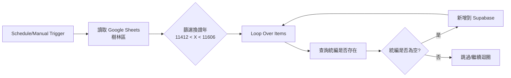
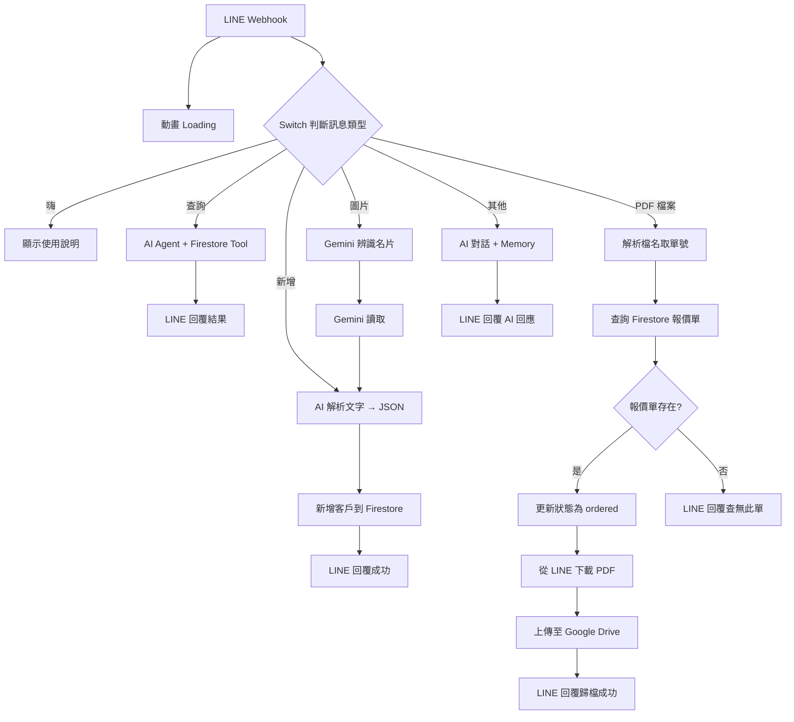

# 傑太環境工程 系統索引

本文件記錄傑太環境工程內部使用的各系統代稱與對應資源。

---

## 📊 業務系統

> **代稱**：當我說「業務系統」，就是指這個系統

### 系統資訊

| 項目 | 說明 |
|------|------|
| **GitHub Repo** | [jetenv-sales-system](https://github.com/nickleo051216/jetenv-sales-system) |
| **用途** | 環境保護許可管理系統 - 工廠資料管理與換證追蹤 |
| **資料庫** | Supabase (`factories` 表) |

### n8n 工作流程

**觸發方式**：
- 手動執行
- 排程觸發（每週二、四 凌晨 3 點）

**資料來源**：
- Google Sheets：`環境保護許可管理系統` → `樹林區` 工作表

**流程說明**：



**欄位對應**：

| Supabase 欄位 | 資料來源 |
|---------------|----------|
| `emsno` | 環保署管理編號 |
| `uniformno` | 統一編號 |
| `facilityname` | 工廠名稱 |
| `facilityaddress` | 工廠地址 |
| `industryareaname` | 工業區名稱 |
| `industryid` | 行業代碼 |
| `industryname` | 行業名稱 |
| `isair` | 是否有空污許可 |
| `iswater` | 是否有水污許可 |
| `iswaste` | 是否有廢棄物許可 |
| `istoxic` | 是否有毒化物許可 |
| `issoil` | 是否有土壤許可 |
| `consultant_company` | 顧問公司 |
| `phone` | 電話 |
| `renewal_year` | 換證年 |
| `notes` | 備註 |
| `scheduled_date` | 預計排程 |
| `result` | 結果 |

---

## 💰 報價系統

> **代稱**：當我說「報價系統」，就是指這個系統

### 系統資訊

| 項目 | 說明 |
|------|------|
| **GitHub Repo** | [jetenv](https://github.com/nickleo051216/jetenv) |
| **線上網址** | [jetenvmoney.zeabur.app](https://jetenvmoney.zeabur.app) |
| **用途** | 報價單管理、客戶管理、LINE Bot 整合 |
| **資料庫** | Firebase Cloud Firestore (`jetenv-a82bc`) |

### n8n 工作流程

#### 1️⃣ LINE Bot 主流程

**Webhook 端點**：`/webhook/money`

**功能分類** (Switch 節點)：

| 觸發條件 | 功能 | 說明 |
|----------|------|------|
| 輸入「嗨」 | Help | 顯示使用說明 |
| 包含「查詢」 | 查詢 | AI Agent 查詢 Firestore 報價單資料 |
| 包含「新增」 | 文字新增 | 透過 AI 解析文字並新增客戶 |
| 訊息類型 = `image` | 圖片名片新增 | Gemini 辨識名片圖片並新增客戶 |
| 訊息類型 = `file` | 報價單回簽上傳 | 處理 PDF 回簽並歸檔 |
| 其他文字 | AI | 一般 AI 對話 |

**流程圖**：



#### 2️⃣ 經濟部公司查詢 API

**Webhook 端點**：`GET /webhook/ipas-conpanynumber?taxId=統一編號`

**功能**：透過統一編號查詢公司基本資料與營業項目

**流程**：
1. 檢查 `taxId` 參數是否存在
2. 呼叫經濟部 GCIS API 查詢公司基本資料
3. 呼叫經濟部 GCIS API 查詢營業項目
4. 格式化並回傳 JSON

**回傳格式**：
```json
{
  "found": true,
  "data": {
    "taxId": "統一編號",
    "name": "公司名稱",
    "status": "公司狀態",
    "representative": "代表人",
    "address": "地址",
    "capital": "資本額",
    "industryStats": ["營業項目1", "營業項目2"]
  }
}
```

#### 3️⃣ 一鍵寄出報價單

**Webhook 端點**：`POST /webhook/email`

**功能**：將報價單 HTML 轉為 PDF 並寄送 Email

**Request Body**：
```json
{
  "to": "收件人 Email",
  "subject": "郵件主旨",
  "clientContact": "客戶聯絡人",
  "quoteNumber": "報價單編號",
  "grandTotal": "總金額",
  "quoteHtml": "報價單 HTML 內容"
}
```

---

## 🔧 相關服務

| 服務 | 用途 |
|------|------|
| **n8n** | 工作流程自動化 |
| **Supabase** | 業務系統資料庫 |
| **Firebase Firestore** | 報價系統資料庫 |
| **Google Sheets** | 環保許可資料來源 |
| **Google Drive** | 報價單回簽歸檔 |
| **LINE Messaging API** | Bot 訊息收發 |
| **OpenRouter** | AI 語言模型 |
| **Google Gemini** | 圖片辨識 |
| **GCIS API** | 經濟部公司資料查詢 |

---

## 📝 更新記錄

- **2025-12-15**：建立本文件，記錄業務系統與報價系統資訊
